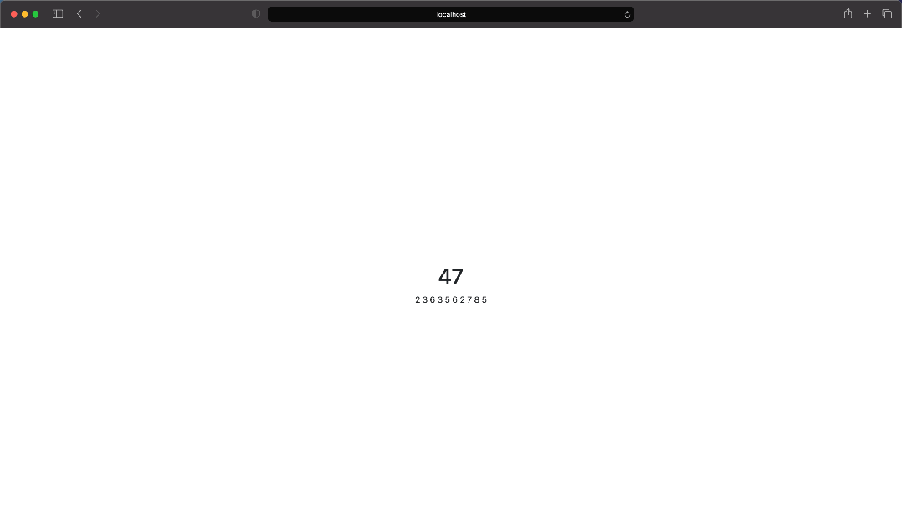

# Decerto-Task

The main goal of this app is to sum the numbers provided from two sources. Current implementation gets data from https://api.random.org and generates numbers using java.util.Random.

## Table of contents
* [Technologies](#technologies)
* [Setup](#setup)
* [Instruction](#instruction)

## Technologies
* Java 8
* Spring Boot 2.4.2
* JUnit 5
* Lombok 1.18.16

## Setup
1. To run this project, execute command `./mvnw spring-boot:run` in the root directory.

## Instruction
The calculations made by the application can be found:
1. http://localhost:8080/solutions
2. http://localhost:8080/index.html

